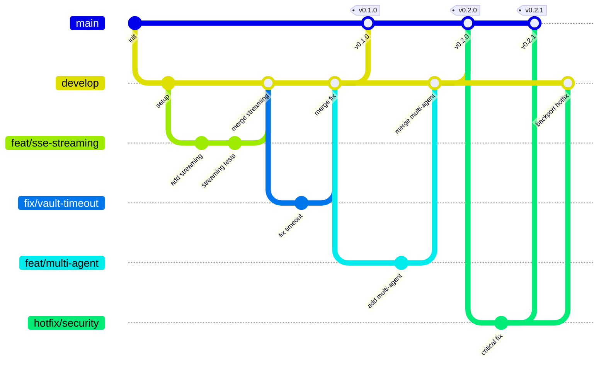

# unified-ui ReACT Agent Service

[](https://github.com/unified-ui/unified-ui-re-act-agent-service/actions/workflows/ci-tests-and-lint.yml)
[](https://www.python.org/downloads/)
[](LICENSE)
[](https://docs.astral.sh/ruff/)

> **High-performance FastAPI microservice for ReACT agent execution** — powers the unified-ui platform's reasoning and acting capabilities.

## Architecture

```
┌─────────────────┐      ┌─────────────────────┐      ┌──────────────────────────┐
│  Agent Service  │ ───▶ │  ReACT Service      │ ───▶ │  unifiedui-sdk           │
│  (Go, :8085)    │      │  (FastAPI, :8086)   │      │  ReActAgentEngine        │
└─────────────────┘      └─────────────────────┘      └──────────────────────────┘
                                   │
                                   ▼
                         ┌─────────────────────┐
                         │  SSE Stream (22     │
                         │  event types)       │
                         └─────────────────────┘
```

The Agent Service sends agent configuration, message history, and user messages to this service. The ReACT Service instantiates a `ReActAgentEngine` from `unifiedui-sdk`, executes it, and streams all 22 SSE event types back.

## Tech Stack

- **Language**: Python 3.13+
- **Framework**: FastAPI + SSE-Starlette
- **Agent Engine**: `unifiedui-sdk` ReActAgentEngine
- **Auth**: Service-to-Service key validation
- **Vault**: Azure Key Vault / HashiCorp Vault / DotEnv
- **Package Manager**: [uv](https://docs.astral.sh/uv/)

## Quick Start

```bash
# Clone the repository
git clone https://github.com/unified-ui/unified-ui-re-act-agent-service.git
cd unified-ui-re-act-agent-service

# Install dependencies
uv sync --all-extras

# Install pre-commit hooks
pre-commit install
pre-commit install --hook-type commit-msg

# Copy environment
cp .env.example .env

# Run dev server
uv run uvicorn app.main:app --reload --port 8086

# Run tests
uv run pytest tests/ -n auto --no-header -q

# Lint & format
uv run ruff check . && uv run ruff format --check .

# Type check
uv run mypy app/
```

## API Endpoints

| Method | Endpoint | Description |
|--------|----------|-------------|
| `GET` | `/health` | Health check |
| `GET` | `/ready` | Readiness check |
| `POST` | `/api/v1/agent/invoke` | Execute agent (SSE stream) |

## Environment Variables

| Variable | Default | Description |
|----------|---------|-------------|
| `SERVER_HOST` | `0.0.0.0` | Server bind host |
| `SERVER_PORT` | `8086` | Server bind port |
| `VAULT_TYPE` | `dotenv` | Vault type (`dotenv`, `azure_keyvault`, `hashicorp_vault`) |
| `AGENT_TO_REACT_SERVICE_KEY` | — | S2S auth key (in vault) |
| `LOG_LEVEL` | `info` | Log level |

## Project Structure

```
unified-ui-re-act-agent-service/
├── app/
│   ├── main.py              # FastAPI app factory
│   ├── config.py            # Pydantic Settings
│   ├── api/
│   │   └── v1/
│   │       ├── health.py    # Health endpoints
│   │       └── agent.py     # Agent invoke endpoint (SSE)
│   ├── services/
│   │   ├── agent_executor.py # ReActAgentEngine orchestration
│   │   └── llm_factory.py    # LLM provider factory
│   ├── models/
│   │   ├── requests.py      # Request schemas
│   │   └── responses.py     # Response schemas
│   ├── middleware/
│   │   └── service_auth.py  # S2S key validation
│   └── core/
│       └── vault/           # Vault ABC + implementations
├── tests/                   # Test suite
├── docs/                    # Documentation & ADRs
└── .github/                 # CI workflows & instructions
```

---

## Branching Strategy

This project follows a **Simplified Flow** branching model — optimized for service releases.



### Branch Types

| Branch | Purpose | Branches from | Merges into |
|--------|---------|---------------|-------------|
| `main` | Production releases — tagged versions | — | — |
| `develop` | Integration branch for features and fixes | `main` | `main` |
| `feat/<name>` | New features or enhancements | `develop` | `develop` |
| `fix/<name>` | Bug fixes (non-critical) | `develop` | `develop` |
| `hotfix/<name>` | Critical production fixes | `main` | `main` + `develop` |
| `docs/<name>` | Documentation-only changes | `develop` | `develop` |
| `refactor/<name>` | Code restructuring without behavior changes | `develop` | `develop` |

### Workflow

1. **Feature/Fix development** — Create a `feat/` or `fix/` branch from `develop`. Open a PR back into `develop`.
2. **Release** — When ready, open a PR from `develop` to `main`. On merge, tag the release.
3. **Hotfixes** — For critical bugs, create a `hotfix/` branch from `main`, fix, and PR to `main`. Then backport to `develop`.

### CI Checks

All PRs must pass:

- ✅ **Branch naming** — `<type>/<description>` enforced
- ✅ **Target validation** — Only `develop` or `hotfix/*` can target `main`
- ✅ **Tests** — `pytest` with 80%+ coverage
- ✅ **Lint** — `ruff check` + `ruff format --check`
- ✅ **Type check** — `mypy` strict mode

### Releases

On merge to `main`, the CD workflow automatically:

1. Calculates the next version from git tags
2. Generates a changelog from conventional commits
3. Creates a GitHub Release with the changelog

---

## Contributing

Contributions are welcome! Please read [CONTRIBUTING.md](CONTRIBUTING.md) for details on our development workflow, code standards, and how to submit pull requests.

---

## Sponsors

If you find this project useful, consider [sponsoring](SPONSORS.md) its development.

---

## License

MIT License — see [LICENSE](LICENSE) for details.
